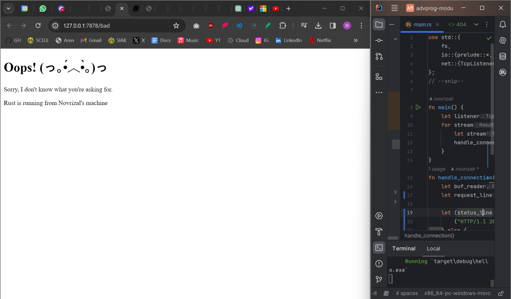

# Module 6: Concurrency

> #### Novrizal Airsyahputra - 2206081780 - Advance Programming B

---

### [COMMIT 1]

**1. What is inside the handle_connection method?**

The handle_connection function is responsible for processing the TCP stream received from a client.
This function reads lines from the TCP stream until it reaches an empty line, indicating the end of the HTTP request headers. 
It then prints out the HTTP request headers for further processing.

- **Argument**

The handle_connection function takes a mutable reference to a TcpStream as its argument. 
This stream represents the connection to a client.

- **Buffered Reader**

Inside the function, a BufReader is created wrapping the TcpStream. 
This is used to efficiently read from the stream line by line.

- **HTTP Request Parsing**

The lines() method is called on the BufReader, which returns an iterator over the lines of the incoming stream.
Each line is then unwrapped from the Result using the map method.
The take_while method is used to collect lines until an empty line is encountered, 
indicating the end of the HTTP request headers.
The collected lines are stored in a vector named http_request.

- **Printing the Request**

The contents of the http_request vector are printed using println!(), allowing to see the HTTP request headers.

---

### [COMMIT 2]

**2. What you have learned about the new code the handle_connection?**

The handle_connection function now reads the contents of "hello.html" 
and constructs an HTTP response with a 200 OK status line, 
including the length of the file contents in the Content-Length header. 
It then sends this response back to the client over the TCP stream.
In the updated handle_connection function, several modifications have been made to handle an HTTP response.

- **File Reading**

The code now includes use std::fs to bring the file system module into scope.
It reads the contents of a file named "hello.html" into a string using fs::read_to_string(). 
If the file read is successful, its contents are stored in the contents variable.

- **HTTP Response Construction**

The status_line variable holds the HTTP status line "HTTP/1.1 200 OK".
The length variable holds the length of the contents of "hello.html".
A string response is constructed, including the status line, content length header, 
and the actual contents of "hello.html". 
These are formatted into an HTTP response string.

- **Sending the Response**

The constructed HTTP response is sent back to the client using stream.write_all(). 
This writes the response bytes to the TCP stream.

---

### [COMMIT 3]

**3. How to split between response and why the refactoring is needed?**

- Split between response can be done by using the `if else` and read the `request_line`.
If it is `"GET / HTTP/1.1"` then it will go to Hello.html file.
Else, it will go to 404.html file.
The `status_line` is also different.

- Refactoring is needed because it will make things easier to distinguish 
between cases within the if else blocks, 
as they now only contain their specific conditional differences. 

---

### [COMMIT 4]
I tried to use two requests, the `/` and `/sleep`. 
Accessing `/` will immediately load the page, while accessing `/sleep` will wait for 10 seconds before loading. 
However, if we access `/sleep` first and then `/`, both paths will wait for 10 seconds because `/` needs to wait until the sleep request is processed. 
This happens because the current server is single-threaded (processes requests sequentially). 
It means that it won't process the second request until the first one is completed. 
If many users try to access it, it will become worse.

---

### [COMMIT 5]

**5. Try to understand how the ThreadPool works!**

A ThreadPool is a collection of spawned threads designed to handle tasks. 
To mitigate the risk of Denial-of-Service attacks, we have to set limit on the ThreadPool.
ThreadPool enables concurrent processing of connections, thus enhancing the server throughput. 
By executing connections asynchronously, the ThreadPool ensures that multiple requests can be processed simultaneously. 
This prevents server overload by limiting the number of threads to a maximum of 4, ensuring efficient resource utilization. 
Even when a request triggers `/sleep`, other requests continue to receive prompt responses.